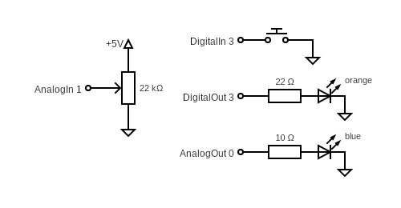

# multi_io-thing #

a simple thing with analog and digital I/O for the "[Modular-Things](https://github.com/modular-things/modular-things)" project

This "thing" allows to control 4 digital inputs, 4 digital outputs, 2 analog inputs, 2 analog outputs and the on-board RGB LED.


> Nota bene: in contrast to the "things" provided by the "Modular Things" project itself, this one has been developed for a [Pimoroni Tiny2040](https://shop.pimoroni.com/products/tiny-2040) board (which I had on my desk) and a [Waveshare RP2040-Zero](https://www.waveshare.com/wiki/RP2040-Zero) (which seems to be the cheapest of all small RP2040 boards). Since it uses the built-in RGB LEDs of that board, you may have to adjust the LED output commands in the Arduino "Firmware" shown below in order to make a thing for a different board.

## Wiring ##


The digital input pins are configured with pull-up resistors which makes them "active low": when open, they report `0` although their internal state is HIGH. Pull them to ground in order to read a `1`.

## Installation and Usage ##

Below are instructions for installation and use of the "multi_io" thing - skip whatever does not seem applicable:

#### Firmware Preparation ####

1. Install Arduino IDE (see https://www.arduino.cc/en/software)
2. Install the board "**Raspberry Pi Pico/RP2040/RP2350** by Earle F. Philhower, III" using the Arduino "Boards Manager"
3. Install "**osap** by Jake Robert Read" using the Arduino "Library Manager"

#### Firmware Installation ####

1. Create a new sketch and rename it to `multi_io`
2. Copy the firmware shown below (or the contents of file [multi_io/firmware-RP2040-Zero/multi_io/multi_io.ino](multi_io/firmware-RP2040-Zero/multi_io/multi_io.ino) if you have a Waveshare RP2040-Zero board) into the sketch editor using the clipboard
3. Connect the RP2040 board via USB and select it from the board dropdown in the Arduino IDE
4. Compile and upload the sketch

#### Software Preparation ####

1. Install Node.js (see https://nodejs.org/en/)
2. Download "modular-things" as a [ZIP archive](https://github.com/modular-things/modular-things/archive/refs/heads/main.zip), unpack it, and move it to a location of your choice
3. Open a terminal window and navigate to the extracted directory
4. run `npm install`

#### Software Installation ####

1. Open the terminal window and navigate to the extracted directory
2. copy the "multi_io" directory from this repository and its contents into the `./things` folder. Delete the `firmware` folder for the wrong board and remove the board suffix from the name of the other (**you will not damage anything if you use the wrong firmware but the built-in LED will not work**). In the end, `./things/multi_io` should have the following structure:
```
./things/multi_io/
  circuit/
    images/
      layout.png
      schematic.png
      preview.png
  firmware/
    multi_io/
      multi_io.ino
  software/
    multi_io.ts
```
3. Insert the following text into file `./things/_things.json` after the first line (i.e., after the opening bracket):
```json
  {
    "author":  "Andreas Rozek",
    "name":    "multi_io",
    "software":"software/multi_io.ts",
    "firmware":"firmware/multi_io/multi_io.ino",
    "images": [
      { 
        "name": "layout", 
        "src": "circuit/images/layout.png"
      },
      { 
        "name": "schematic", 
        "src": "circuit/images/schematic.png"
      },
      { 
        "name": "preview", 
        "src": "circuit/images/preview.png"
      }
    ]
  },
```
4. Insert the following lines into file `./index.ts`
  * `import multi_io from "./multi_io/software/multi_io";`<br>
    e.g., as the last import statement
  * `multi_io,`<br>
    e.g., as the last line in the `export default {` block
5. (Re)start the server<br>
    `npm run dev`

#### Thing Usage ####

1. Connect the properly prepared RP2040 board to your computer via USB.
2. Open the (**custom**) web environment: [http://localhost:3000](http://localhost:3000)
3. Click on "pair new thing" and select the "thing" you connected before<br>(the "List of Things" should now display a description of its interface).
4. Click on "rename" and change the name of your thing to "MultiIO" (this is the name used within the application example).
5. Copy the following example application into the web editor:<br>
```javascript
const BlinkDelay = 800 // LED toggles every BlinkDelay milliseconds

let Timestamp = Date.now(), Value = 0
loop(async () => {
  let now = Date.now()
  if (Timestamp + BlinkDelay < now) {
    Value = (Value === 0 ? 0.1 : 0)
    await MultiIO.setRGB(0,0,Value)
    
    Timestamp = now
  }

  let AnalogIn = await MultiIO.getAnalog(1)
  await MultiIO.setAnalog(0,AnalogIn)
  
  let DigitalIn = await MultiIO.getDigital(3)
  await MultiIO.setDigital(3,DigitalIn)
  
  let HTML = `<div style="padding:4px">
    <b>Value:</b> &nbsp; &nbsp; &nbsp; ${Value}<br>
    <b>AnalogIn:</b> ${AnalogIn.toFixed(3)}<br>
    <b>DigitalIn:</b>&nbsp; ${DigitalIn}
  </div>`
  let Fragment = document.createRange().createContextualFragment(HTML)
  render(Fragment.firstChild)
}, 10)
```
6. Click on "run (shift + enter)"<br>(the LED on the RP2040 board should blink now).

## Firmware (Board-specific) ##

In the "Modular Things" terminology, the "firmware" of a thing is an Arduino sketch which implements a thing's functionality on the hardware side. Here is the one for a "multi_io" thing based on a Tiny2040 (please, use the contents of file [multi_io/firmware-RP2040-Zero/multi_io/multi_io.ino](multi_io/firmware-RP2040-Zero/multi_io/multi_io.ino) for a Waveshare RP2040-Zero board instead):

```c++
#include <osap.h>

#define PIN_LED_R 18
#define PIN_LED_G 19
#define PIN_LED_B 20

  int DigitalIn[4]  = { 0,1,2,3 };
  int DigitalOut[4] = { 4,5,6,7 };
  int AnalogIn[2]   = { 26,27 };
  int AnalogOut[2]  = { 28,29 };

  OSAP_Runtime osap;
  OSAP_Gateway_USBSerial serLink(&Serial);
  OSAP_Port_DeviceNames namePort("multi_io");

/**** RGB Control (RGB LED on Tiny2040 is "active low"!) ****/

  void _setRGB (uint8_t* Data, size_t Length) {
    analogWrite(PIN_LED_R, 65535-(Length < 2 ? 0 : Data[0] + Data[1]*255));
    analogWrite(PIN_LED_G, 65535-(Length < 4 ? 0 : Data[2] + Data[3]*255));
    analogWrite(PIN_LED_B, 65535-(Length < 6 ? 0 : Data[4] + Data[5]*255));
  }
  OSAP_Port_Named setRGB("setRGB",_setRGB);

/**** Digital Input ("active low" because of pull-up resistor) ****/

  size_t _getDigital (uint8_t* Data, size_t Length, uint8_t* Response) {
    if (Length > 0) {
      int Port = Data[0];
      if ((Port >= 0) && (Port <= 3)) {
        int Value = digitalRead(DigitalIn[Port]);
          Response[0] = (Value == LOW ? 1 : 0);                      // no typo!
        return 1;     // when connected to GND, _getDigital sends 1, otherwise 0
      }
    }
    return 0;
  }
  OSAP_Port_Named getDigital("getDigital",_getDigital);

/**** Digital Output ****/

  void _setDigital (uint8_t* Data, size_t Length) {
    if (Length > 0) {
      int Port = Data[0];
      if ((Port >= 0) && (Port <= 3)) {
        digitalWrite(DigitalOut[Port], (Length == 1) || (Data[1] == 0) ? LOW : HIGH);
      }
    }
  }
  OSAP_Port_Named setDigital("setDigital",_setDigital);

/**** Analog Input ****/

  size_t _getAnalog (uint8_t* Data, size_t Length, uint8_t* Response) {
    if (Length > 0) {
      int Port = Data[0];
      if ((Port >= 0) && (Port <= 1)) {
        uint16_t Value = analogRead(AnalogIn[Port]);
          Response[0] = Value & 0xFF;
          Response[1] = Value >> 8 & 0xFF;
        return 2;
      }
    }
    return 0;
  }
  OSAP_Port_Named getAnalog("getAnalog",_getAnalog);

/**** Analog Output ****/

  void _setAnalog (uint8_t* Data, size_t Length) {
    if (Length > 0) {
      int Port = Data[0];
      if ((Port >= 0) && (Port <= 1)) {
        analogWrite(AnalogOut[Port], (Length < 2 ? 0 : Data[1] + Data[2]*255));
      }
    }
  }
  OSAP_Port_Named setAnalog("setAnalog",_setAnalog);

/**** Startup ****/

  void setup() {
    osap.begin();

    analogWriteResolution(16);             // according to RP2040 specifications
    analogReadResolution(12);                                            // dto.

    pinMode(PIN_LED_R,OUTPUT);
    pinMode(PIN_LED_G,OUTPUT);
    pinMode(PIN_LED_B,OUTPUT);

    analogWrite(PIN_LED_R,65535);              // initially switches the LED off
    analogWrite(PIN_LED_G,65535);                                        // dto.
    analogWrite(PIN_LED_B,65535);                                        // dto.

    for (int Port = 0; Port < 4; Port++) {
      pinMode (DigitalIn[Port],INPUT_PULLUP);    // for a well-defined potential
      pinMode(DigitalOut[Port],OUTPUT);
    }

    for (int Port = 0; Port < 2; Port++) {
      analogRead(AnalogIn[Port]);

      pinMode(AnalogOut[Port],OUTPUT);
      analogWrite(AnalogOut[Port],0);
    }
  }

/**** Operation ****/

  void loop() {
    osap.loop();
  }
```

## Software ##

In the "Modular Things" terminology, the "software" of a thing is its JavaScript interface (which may still include some additional functionality on the software side). Here is the one for the "multi_io" thing:

```typescript
import Thing       from "../../../src/lib/thing"
import Serializers from "../../../src/lib/osapjs/utils/serializers"

const { readUint16,writeUint16 } = Serializers

export default class multi_io extends Thing {
  async setRGB (R:number, G:number, B:number):Promise<void> {
    const LED_R = Math.floor(65535 * Math.max(0,Math.min(R,1)))
    const LED_G = Math.floor(65535 * Math.max(0,Math.min(G,1)))
    const LED_B = Math.floor(65535 * Math.max(0,Math.min(B,1)))

    const Datagram = new Uint8Array([
      LED_R & 0xFF, (LED_R >> 8) & 0xFF,
      LED_G & 0xFF, (LED_G >> 8) & 0xFF,
      LED_B & 0xFF, (LED_B >> 8) & 0xFF,
    ])
    await this.send('setRGB',Datagram)
  }

/**** Digital Input ****/

  async getDigital (Port:number):Promise<boolean> {
    Port = Math.floor(Port)
    if ((Port < 0) || (Port > 3)) throw new Error(
      'multi-io thing: invalid digital input port ' + Port
    )

    const Data = await this.send('getDigital',new Uint8Array([Port]))
    return (Data[0] > 0)
  }

/**** Digital Output ****/

  async setDigital (Port:number, Value:boolean):Promise<void> {
    Port = Math.floor(Port)
    if ((Port < 0) || (Port > 3)) throw new Error(
      'multi-io thing: invalid digital output port ' + Port
    )

    const Datagram = new Uint8Array([Port,Value ? 255 : 0])
    await this.send('setDigital',Datagram)
  }

/**** Analog Input ****/

  async getAnalog (Port:number):Promise<number> {
    Port = Math.floor(Port)
    if ((Port < 0) || (Port > 1)) throw new Error(
      'multi-io thing: invalid analog input port ' + Port
    )

    const Data = await this.send('getAnalog',new Uint8Array([Port]))
    return (Data[0] + Data[1]*255) / 4096
  }

/**** Analog Output ****/

  async setAnalog (Port:number, Value:number):Promise<void> {
    Port = Math.floor(Port)
    if ((Port < 0) || (Port > 1)) throw new Error(
      'multi-io thing: invalid analog output port ' + Port
    )

    Value = Math.floor(4096 * Math.max(0,Math.min(Value,1)))
    await this.send('setAnalog',new Uint8Array([
      Port, Value & 0xFF, Value >> 8 & 0xFF
    ]))
  }

/**** API Specification ****/

  public api = [{
    name:  'setRGB',
    args:  [
      'R: 0 to 1',
      'G: 0 to 1',
      'B: 0 to 1'
    ]
  },{
    name:  'getDigital',
    args:  [ 'port: 0 to 3' ],
    return:'true or false'
  },{
    name:  'setDigital',
    args:  [ 'port: 0 to 3', 'value: true or false' ]
  },{
    name:  'getAnalog',
    args:  [ 'port: 0 to 1' ],
    return:'0 to 1'
  },{
    name:  'setAnalog',
    args:  [ 'port: 0 to 1', 'value: 0 to 1' ]
  }]
}
```

## Application Example ##

An "application" may be some JavaScript code entered into and run by the "Modular Things" web editor.

> **Important**: as soon as you plan to use custom things, you can no longer use the original web environment found at [https://modular-things.com/](https://modular-things.com/) but must navigate your browser to [http://localhost:3000](http://localhost:3000) (assuming that you use the default port).

Here is an example for an application using the "multi_io" thing:

```javascript
const BlinkDelay = 800 // LED toggles every BlinkDelay milliseconds

let Timestamp = Date.now(), Value = 0
loop(async () => {
  let now = Date.now()
  if (Timestamp + BlinkDelay < now) {
    Value = (Value === 0 ? 0.1 : 0)
    await MultiIO.setRGB(0,0,Value)
    
    Timestamp = now
  }

  let AnalogIn = await MultiIO.getAnalog(1)
  await MultiIO.setAnalog(0,AnalogIn)
  
  let DigitalIn = await MultiIO.getDigital(3)
  await MultiIO.setDigital(3,DigitalIn)
  
  let HTML = `<div style="padding:4px">
    <b>Value:</b> &nbsp; &nbsp; &nbsp; ${Value}<br>
    <b>AnalogIn:</b> ${AnalogIn.toFixed(3)}<br>
    <b>DigitalIn:</b>&nbsp; ${DigitalIn}
  </div>`
  let Fragment = document.createRange().createContextualFragment(HTML)
  render(Fragment.firstChild)
}, 10)
```



This application lets the built-in LED blink blue, pressing the switch will light the orange LED up, and the attached potentometer will control the brightness of the blue LED.

## License ##

[MIT License](LICENSE.md)
